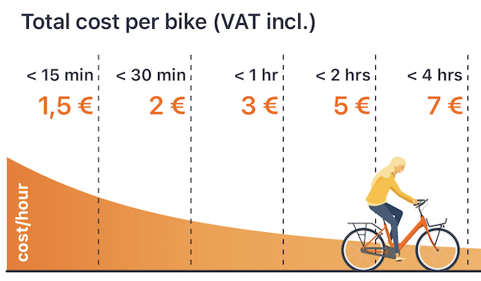

# Donkey Republic x TOMP

This is a document that describes how Donkey Republic will work with TOMP API.
Please note that it is still work in progress and significant parts of the solution
may change.

# Table of Contents
* [General Information](#general-information)
* [Process Identifiers](#process-identifiers)
* [How to use the API](#how-to-use-the-api)
  * [Api Key and other headers](#api-key-and-other-headers)
  * [Errors](#errors)
* [A word about pricing](#a-word-about-pricing)
* [Lifecycle of a rental made with TOMP](#lifecycle-of-a-rental-made-with-tomp)
* [Endpoints](#endpoints)
  * [Operator Information](#operator-information)
    * [Stations](#stations)
    * [Available assets](#available-assets)
  * [Plannings](#plannings)
    * [Planning create](#planning-create)
  * [Bookings](#bookings)
    * [Booking create](#booking-create)
    * [Booking events](#booking-events)

## General Information
### Donkey Republic in various cities
Donkey TOMP API is containerized into particular donkey cities. Therefore when calling
`/api/aggregators/tomp/donkey_rotterdam/...` endpoints then it contains information only
about the system operation in copenhagen.

## Process Identifiers
TOMP processes used in Donkey:

Planning:
* `SPECIFIC_LOCATION_BASED` - planning is done from particular station
* `ATOMIC_PLANNING_AND_BOOKING` - booking intent planning should be immediatelly followed by booking

## How to use the API
### Api key and other headers

All API Requests need to be authenticated with the API key, the body of POST requests should be in json format
and the request should accept json format in response. Like so:

```
POST /api/aggregators/tomp/donkey_rotterdam/plannings?booking_intent=true  HTTP/1.1
Content-Type: application/json
Accept: application/json
X-Api-Key: TheApiKey
...other headers like host, content length etc

{
  "from": {
      "stationId": "3628"
  },
  "nrOfTravelers": 1
}
```

### Errors
There is a general guideline about how errors should be handled in TOMP api described [here](https://github.com/TOMP-WG/TOMP-API/wiki/Error-handling-in-TOMP)

The first indication about what kind of error you got is HTTP status code and then more information is represented in returned json that looks like this:

```
{
  "errorcode": 2002,
  "title": "Invalid parameters",
  "detail": "Invalid stationId"
}
```

There are 2 error types that don't guarantee proper json response and those are errors with following HTTP statuses:
* `500` - unexpected error
* `404` - not found

## A word about pricing

The pricing in our system is build in such a way to promote longer rentals so that people don't need
to feel rushed on a bike and can keep the bike longer even if they are taking pauses (going to the restaurant
or a shop).

The example pricing could look like the following:



Which basically means:
* If your ride is up to 15 minutes - the price is 1.5 EUR
* If your ride is between 15 and 30 minutes - the price is 2 EUR
* If between 30 minutes and 1 hour - 3 EUR

[TOMP's pricing definition](https://github.com/TOMP-WG/TOMP-API/wiki/Payment#in-depth-the-fare-object) doesn't directly support
such a pricing but it does have a scaling type of pricing that can handle an example given in TOMP's documentation:
> bike rental, 1.50USD per half hour for the first hour, after this 2.50USD per hour

We are leveraging this scaling model to produce our pricing. So the example Donkey pricing seen in the picture above would look like this:

```
[
  {
    "amount": 1.5,
    "units": 15,
    "scaleFrom": 0,
    "scaleTo": 15,
    "scaleType": "MINUTE",
    "currencyCode": "EUR",
    "type": "FLEX",
    "unitType": "MINUTE",
    "vatRate": 21.0
  },
  {
    "amount": 0.5,
    "units": 15,
    "scaleFrom": 15,
    "scaleTo": 30,
    "scaleType": "MINUTE",
    "currencyCode": "EUR",
    "type": "FLEX",
    "unitType": "MINUTE",
    "vatRate": 21.0
  },
  {
    "amount": 1.0,
    "units": 30,
    "scaleFrom": 30,
    "scaleTo": 60,
    "scaleType": "MINUTE",
    "currencyCode": "EUR",
    "type": "FLEX",
    "unitType": "MINUTE",
    "vatRate": 21.0
  },
  {
    "amount": 2.0,
    "units": 60,
    "scaleFrom": 60,
    "scaleTo": 120,
    "scaleType": "MINUTE",
    "currencyCode": "EUR",
    "type": "FLEX",
    "unitType": "MINUTE",
    "vatRate": 21.0
  },
  ...
]
```

So basically our pricing in TOMP's terms is defined as:
* For first 15 minutes of the ride we charge 1.5 EUR per 15 minutes
* Later up to 30 minutes of the ride we charge 0.5 EUR per 15 minutes
* Later up to 60 minutes of the ride we charge 1 EUR per 30 minutes
* Then up to 120 minutes of the ride we charge 2 EUR per 60 minutes

Our pricings also are usually defined with set amounts till 1 or 2 days of rental time.
Then we have a pricing item that says what's the price for each additional day.
In case of this example pricing we had prices defined up to 72 hours and then we had the additional
day price point which will look like that (notice that `scaletTo` is not defined which means
that this is the pricing for the rest of the ride):


```
  {
    "amount": 7.0,
    "units": 1440,
    "scaleFrom": 4320,
    "scaleType": "MINUTE",
    "currencyCode": "EUR",
    "type": "FLEX",
    "unitType": "MINUTE",
    "vatRate": 21.0
  }
```

Basically this pricing point means:
After the ride was 4320 minutes long (3 days) we charge 7 EUR per 1440 minutes (1 day)

## Lifecycle of a rental made with TOMP

### Creating a booking
1. Fetch stations using [Stations endpoint](#stations).

   This endpoint returns locations of Donkey stations. It doesn't change that often so it can be cached
   on aggregator's side and refreshed very sporadically.

2. Fetch number of available bikes and parking places in each station using [Available assets endpoint](#available-assets)

   This endpoint returns numbers of available bikes in each station (per bike type, so if there are both ebikes and bikes available
   in particular city it would return separate numbers for how many ebikes and how many bikes are available). Moreover, it returns number
   of available parking spaces per station.

3. Once you know which station you want to rent a bike from start with sygnalizing your booking intention by calling [Planning create endpoint](#planning-create)
   with the station of choice.

   As a result you will receive a list of tentative bookings that are possible to made from given stations. So if there are 2 types of bikes possible
   you will receive 2 booking options. If there is no available bikes in given location you will receive empty list of options.

4. Initiate your booking by calling [Booking create endpoint](#booking-create)

   For this call you will need one of the booking IDs you got in point #3 and information about the customer. As a result you will
   get a booking in bending state.

5. TBA

### Cancelling the booking

You can cancel your booking by calling [Booking events endpoint](#cancelling-booking) with `CANCEL` event.
Keep in mind that the booking can be cancelled only till first unlock of the bike.


## Endpoints
### Operator Information
#### Stations
```
//REQUEST
GET .../operator/stations

//RESPONSE
[
    {
        "stationId": "10811",
        "name": "Vægtergangen II",
        "coordinates": {
            "lng": 12.6389995,
            "lat": 55.6427773
        }
    },
    {
        "stationId": "17572",
        "name": "Flintholm Alle",
        "coordinates": {
            "lng": 12.5021719,
            "lat": 55.6824307
        }
    },
    {
        "stationId": "7434",
        "name": "Tøndergade",
        "coordinates": {
            "lng": 12.5418888,
            "lat": 55.6696496
        }
    }
]
```

#### Available assets
When the amount of available asset type is 0 in given station the entry for that (asset type, station) pair does not appear in the response

```
//REQUEST
GET ../operator/available-assets

//RESPONSE
[
    // Station 10811 doesn't have any available bikes, only parking spots
    {
        "id": "dropoff",
        "assetClass": "PARKING",
        "assetSubClass": "dropoff",
        "sharedProperties": {},
        "stationId": "10811",
        "nrAvailable": 3
    },

    // Station 17572  has 2 parking spots and 1 available bike
    {
        "id": "dropoff",
        "assetClass": "PARKING",
        "assetSubClass": "dropoff",
        "sharedProperties": {},
        "stationId": "17572",
        "nrAvailable": 2
    },
    {
        "id": "bike",
        "assetClass": "BICYCLE",
        "assetSubClass": "bike",
        "sharedProperties": {},
        "stationId": "17572",
        "nrAvailable": 1
    },

    // Station 7434 has 1 bike, 2 ebikes and no available parking spots
    {
        "id": "ebike",
        "assetClass": "BICYCLE",
        "assetSubClass": "ebike",
        "sharedProperties": {},
        "stationId": "17572",
        "nrAvailable": 1
    },
    {
        "id": "bike",
        "assetClass": "BICYCLE",
        "assetSubClass": "bike",
        "sharedProperties": {},
        "stationId": "17572",
        "nrAvailable": 2
    }
]
```

### Plannings
#### Planning create

When station has only one type of vehicles:

```
POST .../plannings?booking-intent=true
{
  "from": {
    "coordinates": {
      "lng": 12.333,
      "lat": 55.123,
    }
    "stationId": "1551"
  },
  "nrOfTravelers": 1
}

// RESPONSE

201 Created
{
  "validUntil": "2020-11-16T15:46:49.133Z",
  "options": [
    {
      "id": "FU-lA9P4MRWn1F8QkO8EiQ",
      "legs": [
        {
          "id": "839423832jIFwe",
          "from": {
            "stationId": "123",
            "coordinates": {
              "lng": 12.333,
              "lat": 55.123
            }
          },
          "assetType": {
            "id": "bike",
            "assetClass": "BICYCLE",
            "assetSubClass": "bike"
          },
          "pricing": {
            "planId": "17",
            "name": "Bike Price",
            "description": "Prices for Bikes",
            "taxable": false,
            "fare": {
              "estimated": false,
              "parts": [
                {
                  "amount": 12.5,
                  "units": 15,
                  "scaleFrom": 0,
                  "scaleTo": 15,
                  "scaleType": "MINUTE",
                  "currencyCode": "DKK",
                  "type": "FLEX",
                  "unit_type": "MINUTE",
                  "vatRate": 25
                },
                {
                  "amount": 2.5,
                  "units": 15,
                  "scaleFrom": 15,
                  "scaleTo": 30,
                  "scaleType": "MINUTE",
                  "currencyCode": "DKK",
                  "type": "FLEX",
                  "unit_type": "MINUTE",
                  "vatRate": 25
                }
                ....
              ]
            }
          }
        }
      ]
    }
  ]
}
```

When station has both bikes and ebikes available the response contains two booking options

```
//
// REQUEST

POST .../plannings&booking-intent=true
{
  "from": {
    "stationId": "123",
    "coordinates": {
      "lng": 12.333,
      "lat": 55.123
    }
  },
  "nrOfTravelers": 1
}

// RESPONSE

201 Created
{
  "validUntil": "2020-11-16T15:46:49.133Z",
  "options": [
    {
      "id": "FU-lA9P4MRWn1F8QkO8EiQ",
      "legs": [
        {
          "id": "839423832jIFwe",
          "from": {
            "stationId": "123",
            "coordinates": {
              "lng": 12.333,
              "lat": 55.123
            }
          },
          "assetType": {
            "id": "bike",
            "assetClass": "BICYCLE",
            "assetSubClass": "bike"
          },
          "pricing": {...}
        }
      ]
    },
    {
      "id": "f24n430FA324FOOCC21"",
      "legs": [
        {
          "id": "239fwefJJOQPBGEAZZ23"
          "from": {
            "stationId": "123",
            "coordinates": {
              "lng": 12.333,
              "lat": 55.123
            }
          },
          "assetType": {
            "id": "ebike",
            "assetClass": "BICYCLE",
            "assetSubClass": "ebike"
          },
          "pricing": {...}
        }
      ]
    }
  ]
}
```

##### Possible errors
* There was a problem with some parameters in the request. Example response

  ```
    HTTP/1.1 400 Bad Request
    Content-Type: application/json

    {
      "errorcode": 2002,
      "title": "Invalid parameters",
      "detail": "/from/stationId is required"
    }
  ```

### Bookings
#### Booking create
Booking should happen immediatelly after the planning produced booking options. Otherwise there is a risk of
someone fetching all the bikes from particular station. At this point booking is in state PENDING.
We don't provide access codes to the bike yet.

```
// REQUEST
POST /bookings/
{
  "id": "FU-lA9P4MRWn1F8QkO8EiQ",
  "customer": {
    "id": "1421322", // id of the customer in MP service
    "firstName": "John",
    "lastName": "Smith",
    "email": "john.smith@example.com",
    "phone": [
      {
        "number": "+123123123",
      }
    ]
  }
}


//RESPONSE
201 Created
{
  "id": "FU-lA9P4MRWn1F8QkO8EiQ",
  "state": "PENDING",
  "legs": [
    {
      "id": "839423832jIFwe",
      "from": {
        "stationId": "123",
        "coordinates": {
          "lng": 12.333,
          "lat": 55.123
        }
      },
      "assetType": {
        "id": "bike",
        "assetClass": "BICYCLE",
        "assetSubClass": "bike"
      },
      "asset": {
        "id": "bike-12331",
        "overridenProperties": {
          "name": "Speedy"
        }
      },
      "pricing": {.... },
    }
  ]
}
```

##### Possible errors
* Some parameter is invalid
  ```json
    HTTP/1.1 400 Bad Request
    Content-Type: application/json

    {
      "errorcode": 3002,
      "title": "Invalid parameters",
      "detail": "/id is required, /customer/email is invalid"
    }
  ```

* The station where the booking was drafted for doesn't have any available bikes anymore
  ```json
    HTTP/1.1 410 Bad Request
    Content-Type: application/json

    {
      "errorcode": 3202,
      "title": "Vehicles no longer available",
    }
  ```

* Given user already has an active booking
  ```json
    HTTP/1.1 400 Bad Request
    Content-Type: application/json

    {
      "errorcode": 3004,
      "title": "This user has an active booking",
    }
  ```


#### Booking Events
##### Cancelling booking
```
// REQUEST
POST /bookings/FU-lA9P4MRWn1F8QkO8EiQ/events
{
  operation: "CANCEL"
}

// RESPONSE
201 Created
{
  "id": "FU-lA9P4MRWn1F8QkO8EiQ",
  "state": "CANCELLED",
  "customer": {
    "id": "1421322",
    "firstName": "John",
    "lastName": "Smith",
    "email": "john.smith@example.com",
    "phone": [
      {
        "number": "+123123123",
      }
    ]
  },
  "legs": [
    {
      "id": "839423832jIFwe",
      "departureTime": "2020-11-18T20:34:00Z",
      "from": {
        "stationId": "123",
        "coordinates": {
          "lng": 12.333,
          "lat": 55.123
        }
      },
      "assetType": {
        "id": "bike",
        "assetClass": "BICYCLE",
        "assetSubClass": "bike"
      },
      "asset": {
        "id": "bike-12331",
        "overridenProperties": {
          "name": "Speedy"
        }
      },
      "pricing": {.... },
    }
  ]
}
```

### Trip Execution
To be defined ...

### Support
To be defined...

Will be used to handle support cases. Alternatively a direct connection between TO an MP ticketing system can also be set up.

### Payment
To be defined...

Used by TO to instruct MP what to charge. This includes ride price after rental but also fees.
